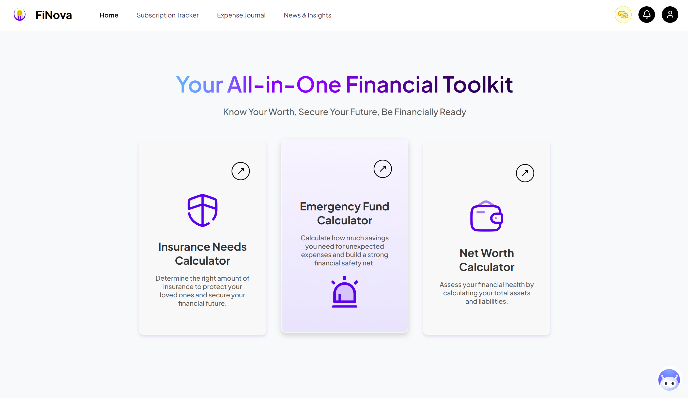
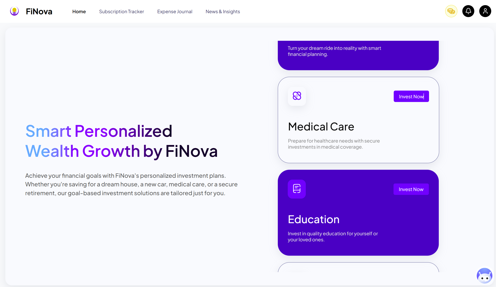
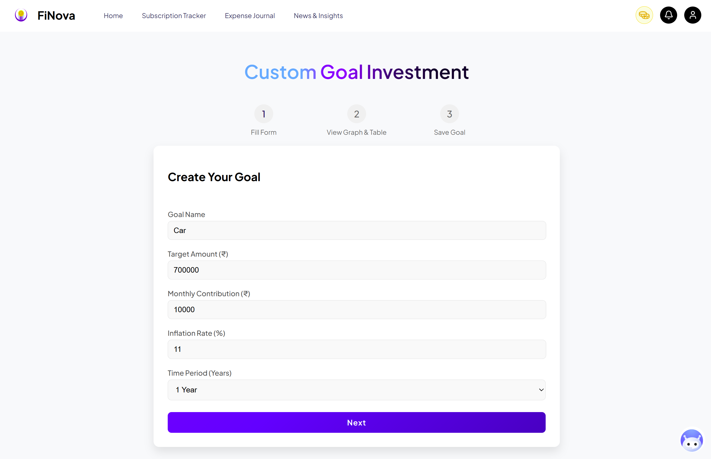
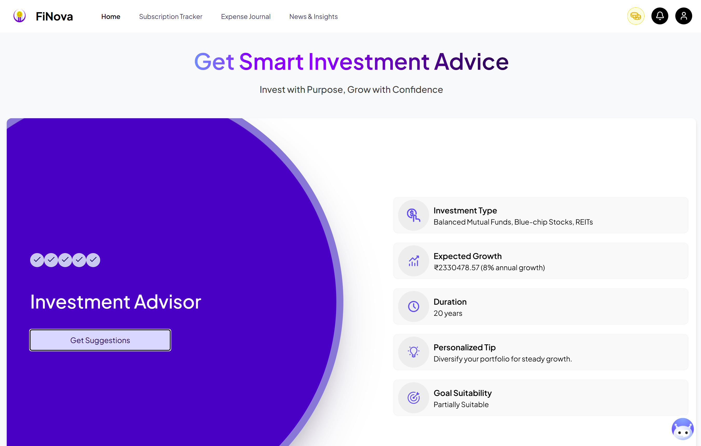
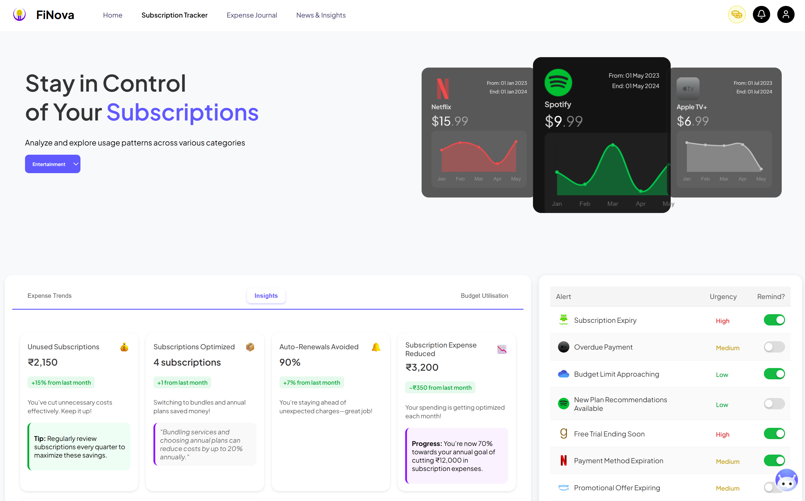
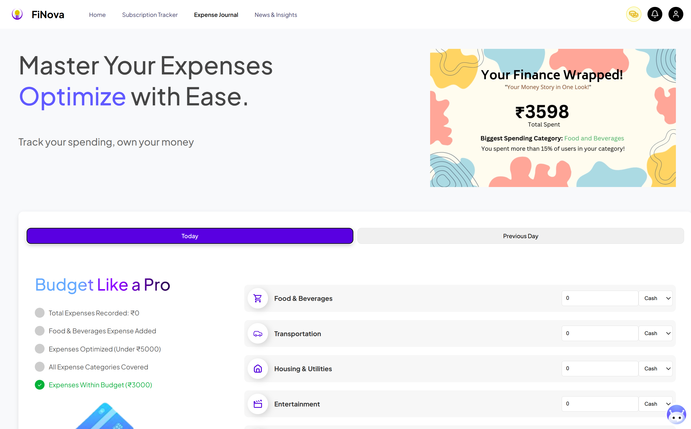
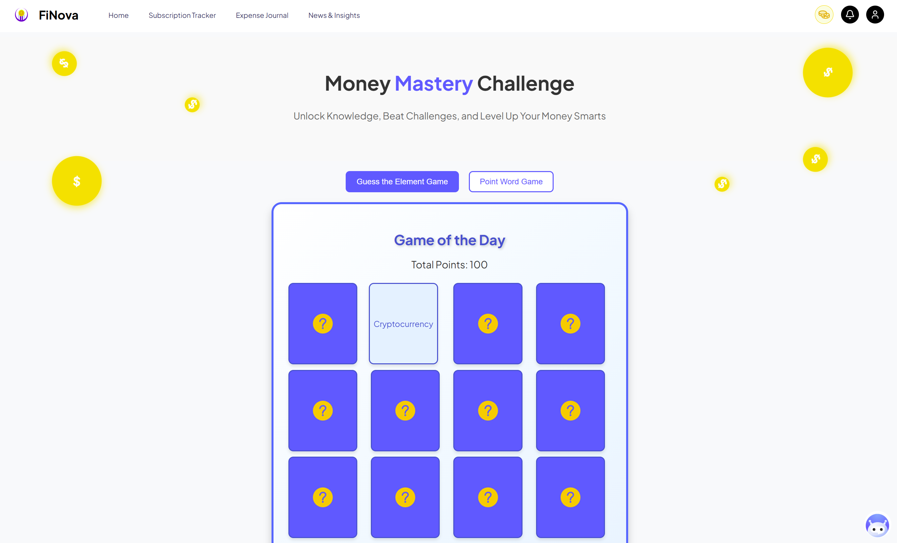

# 💸 Finova — Master Your Money with Confidence  

*Your all-in-one intelligent platform for personal finance, wealth building, and smart decision-making.*  
> Developed by **Team AI TOOK MY JOB** 

---

## 🌟 Why Finova?

Finova is not just another finance app — it's your **financial co-pilot**.  
Track your expenses, plan investments, build wealth, and **turn financial chaos into clarity** with AI-powered tools, gamified learning, and beautiful dashboards.

---

## 🚀 Key Features

### 🔍 1. Clarity at Your Fingertips – *Smart Financial Tools*  
Quickly evaluate your financial health:
- **Net Worth Calculator**
- **Emergency Fund Planner**
- **Insurance Coverage Estimator**  

---

### 🎯 2. Invest with Purpose – *Personalized Wealth Growth Plans*  
Get custom investment advice based on:
- Your goals
- Your risk level
- Your timeline  

---

### 📊 3. Invest Like a Pro – *AI-Powered Portfolio Advisor*  
- AI-suggested portfolios
- Real-time asset allocation tracking
- Performance metrics & diversification tips  

---

### 💡 4. Take Back Control – *Subscription Tracker*  
Avoid hidden costs and billing surprises:
- Monitor recurring charges
- Cancel unnecessary services with ease  

---

### 🧾 5. Know Where It Goes – *Interactive Expense Journal*  
- Track every transaction
- Smart categorization & visual insights
- Budgeting made simple  

---

### 🤖 6. Meet Your Financial Sidekick – *FinGenie Chatbot*  
Ask questions. Get answers. Anytime.  
- Personalized financial tips
- Real-time advice
- AI with a human touch  

---

### 🕹️ 7. Learn & Level Up – *Money Mastery Challenge*  
Turn learning into a game:
- Weekly & monthly finance challenges
- Topics: Budgeting, debt, saving, investing, credit scores
- Win badges, earn ranks, beat the leaderboard  

> _“Beat the game. Build your wealth. Become a Money Master.”_

---

## 🛠️ Built With 

| Layer         | Tech Stack                             |
|---------------|-----------------------------------------|
| **Frontend**  | React.js, CSS                           |
| **Backend**   | Node.js, Express.js                     |
| **Database**  | PostgreSQL                              |
| **AI Layer**  | FinGenie Chatbot (Custom NLP Model)     |
| **APIs**      | Market data APIs for real-time insights |

